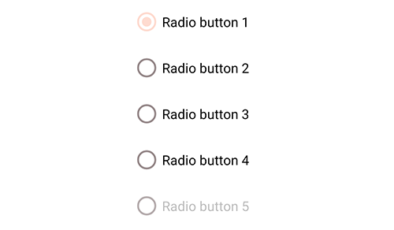

<!--docs:
title: "Material selection controls: Radio buttons"
layout: detail
section: components
excerpt: "Selection controls allow the user to select options."
iconId: radiobutton
path: /catalog/radiobuttons/
-->

# Selection controls: radio buttons

[Selection controls](https://material.io/components/selection-controls#usage)
allow the user to select options.

Use radio buttons to:

*   Select a single option from a list
*   Expose all available options
*   If available options can be collapsed, consider using a dropdown menu
    instead, as it uses less space.


**Contents**

*   [Using radio buttons](#using-radio-buttons)
*   [Radio button](#radio-button)
*   [Theming radio buttons](#theming-radio-buttons)

## Using radio buttons

Before you can use Material radio buttons, you need to add a dependency to the
Material Components for Android library. For more information, go to the
[Getting started](https://github.com/material-components/material-components-android/tree/master/docs/getting-started.md)
page.

_**Note:** `<RadioButton>` is auto-inflated as
`<com.google.android.material.button.MaterialRadioButton>` via
`MaterialComponentsViewInflater` when using a non-Bridge
`Theme.MaterialComponents.*` theme._

### Making radio buttons accessible

Radio buttons support content labeling for accessibility and are readable by
most screen readers, such as TalkBack. Text rendered in radio buttons is
automatically provided to accessibility services. Additional content labels are
usually unnecessary.

### Grouping radio buttons

Changes in the states of one radio button can affect other buttons in the group.
Specifically, selecting a `RadioButton` in a `RadioGroup` will de-select all
other buttons in that group. See the
[example section below](#radio-buttons-example) for implementation details.

## Radio button

A radio button is a circle that is filled in with an inset when selected. Radio
buttons allow the user to select one option from a set. Use radio buttons when
the user needs to see all available options. If available options can be
collapsed, consider using a dropdown menu because it uses less space.

### Radio buttons example

API and source code:

*   `MaterialRadioButton`
    *   [Class definition](https://developer.android.com/reference/com/google/android/material/radiobutton/MaterialRadioButton)
    *   [Class source](https://github.com/material-components/material-components-android/tree/master/lib/java/com/google/android/material/radiobutton/MaterialRadioButton.java)
*   `RadioGroup`
    *   [Class definition](https://developer.android.com/reference/android/widget/RadioGroup)

The following example shows a radio button group with five radio buttons.


In the layout:

```xml
<RadioGroup
    android:id="@+id/radioGroup"
    android:checkedButton="@+id/radio_button_1"
    android:layout_width="match_parent"
    android:layout_height="wrap_content">
    <RadioButton
        android:id="@+id/radio_button_1"
        android:layout_width="match_parent"
        android:layout_height="match_parent"
        android:text="@string/label_1"/>
    <RadioButton
        android:id="@+id/radio_button_2"
        android:layout_width="match_parent"
        android:layout_height="match_parent"
        android:text="@string/label_2"/>
    <RadioButton
        android:id="@+id/radio_button_3"
        android:layout_width="match_parent"
        android:layout_height="match_parent"
        android:text="@string/label_3"/>
    <RadioButton
        android:id="@+id/radio_button_4"
        android:layout_width="match_parent"
        android:layout_height="match_parent"
        android:text="@string/label_4"/>
    <RadioButton
        android:id="@+id/radio_button_5"
        android:layout_width="match_parent"
        android:layout_height="match_parent"
        android:enabled="false"
        android:text="@string/label_5"/>
</RadioGroup>
```

In code:

```kt
val checkedRadioButtonId = radioGroup.checkedRadioButtonId // Returns View.NO_ID if nothing is checked.
radioGroup.setOnCheckedChangeListener { group, checkedId ->
    // Responds to child RadioButton checked/unchecked
}

// To check a radio button
radioButton.isChecked = true

// To listen for a radio button's checked/unchecked state changes
radioButton.setOnCheckedChangeListener { buttonView, isChecked
    // Responds to radio button being checked/unchecked
}
```

## Key properties

### Radio button attributes

Element                    | Attribute                                  | Related method(s)                                          | Default value
-------------------------- | ------------------------------------------ | ---------------------------------------------------------- | -------------
**To use material colors** | `app:useMaterialThemeColors`               | `setUseMaterialThemeColors`<br/>`isUseMaterialThemeColors` | `true` (ignored if `app:buttonTint` is set)
**Color**                  | `app:buttonTint`                           | `setButtonTintList`<br/>`getButtonTintList`                | `null`
**Min size**               | `android:minWidth`<br/>`android:minHeight` | `(set/get)MinWidth`<br/>`(set/get)MinHeight`               | `?attr/minTouchTargetSize`

The color of the radio button defaults to `?attr/colorOnSurface` (unchecked) and
`?attr/colorSecondary` (checked) defined in your app theme. If you want to
override this behavior, as you might with a custom drawable that should not be
tinted, set `app:useMaterialThemeColors` to `false`:

```xml
<RadioButton
        ...
    app:useMaterialThemeColors="false"
    />
```

### Text label attributes

Element        | Attribute                | Related method(s)                  | Default value
-------------- | ------------------------ | ---------------------------------- | -------------
**Text label** | `android:text`           | `setText`<br/>`getText`            | `null`
**Color**      | `android:textColor`      | `setTextColor`<br/>`getTextColors` | inherits from `AppCompatRadioButton`
**Typography** | `android:textAppearance` | `setTextAppearance`                | inherits from `AppCompatRadioButton`

### Radio button states

Radio buttons can be selected or unselected. Radio buttons have enabled,
disabled, hover, focused, and pressed states.


### Styles

Element           | Style
----------------- | ------------------------------------------------------
**Default style** | `Widget.MaterialComponents.CompoundButton.RadioButton`

Default style theme attribute: `?attr/radioButtonStyle`

See the full list of
[styles](https://github.com/material-components/material-components-android/tree/master/lib/java/com/google/android/material/radiobutton/res/values/styles.xml)
and
[attrs](https://github.com/material-components/material-components-android/tree/master/lib/java/com/google/android/material/radiobutton/res/values/attrs.xml).

## Theming radio buttons

Radio buttons support
[Material Theming](https://material.io/components/selection-controls#theming)
and can be customized in terms of color and typography.

### Radio button theming example

API and source code:

*   `MaterialRadioButton`
    *   [Class definition](https://developer.android.com/reference/com/google/android/material/radiobutton/MaterialRadioButton)
    *   [Class source](https://github.com/material-components/material-components-android/tree/master/lib/java/com/google/android/material/radiobutton/MaterialRadioButton.java)
*   `RadioGroup`
    *   [Class definition](https://developer.android.com/reference/android/widget/RadioGroup)

The following example shows a radio button with Material Theming.



#### Implementing radio button theming

Using theme attributes in `res/values/styles.xml` (themes all radio buttons and
affects other components):

```xml
<style name="Theme.App" parent="Theme.MaterialComponents.*">
    ...
    <item name="colorOnSurface">@color/shrine_pink_900</item>
    <item name="colorSecondary">@color/shrine_pink_100</item>
</style>

```

or using default style theme attributes, styles and theme overlays (themes all
radio buttons but does not affect other components):

```xml
<style name="Theme.App" parent="Theme.MaterialComponents.*">
    ...
    <item name="radioButtonStyle">@style/Widget.App.RadioButton</item>
</style>

<style name="Widget.App.RadioButton" parent="Widget.MaterialComponents.CompoundButton.RadioButton">
    <item name="materialThemeOverlay">@style/ThemeOverlay.App.RadioButton</item>
</style>

<style name="ThemeOverlay.App.RadioButton" parent="">
    <item name="colorOnSurface">@color/shrine_pink_900</item>
    <item name="colorSecondary">@color/shrine_pink_100</item>
</style>
```

you can also change the radio button colors via the `?attr/buttonTint`
attribute:

```xml
<style name="Widget.App.RadioButton" parent="Widget.MaterialComponents.CompoundButton.RadioButton">
   <item name="buttonTint">@color/button_tint</item>
</style>
```

and in `color/button_tint.xml`:

```xml
<selector xmlns:android="http://schemas.android.com/apk/res/android">
  <item android:color="@color/shrine_pink_900" android:state_checked="true"/>
  <item android:alpha="0.38" android:color="@color/shrine_pink_100" android:state_enabled="false"/>
  <item android:color="@color/shrine_pink_100"/>
</selector>
```

or using the styles in the layout (affects only this radio button):

```xml
<RadioButton
        ...
    style="@style/Widget.App.RadioButton"
    />
```
